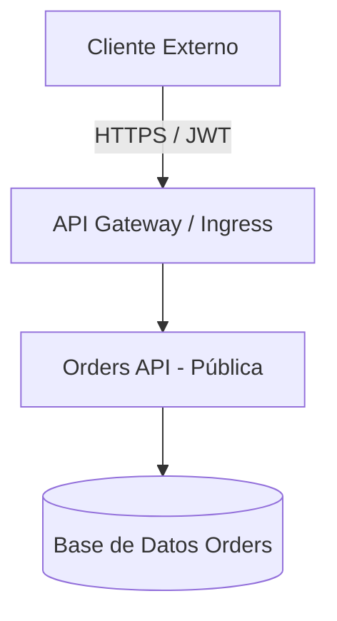
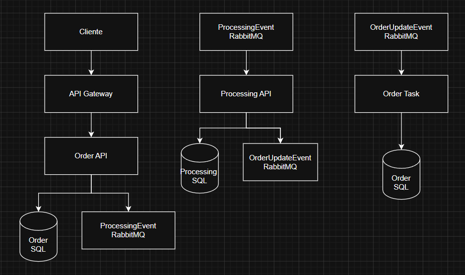

# Registro de Decisiones y Respuestas Técnicas

**Nombre del Candidato:** Andres Guillermo Martinez Sierra
**Fecha:** 13/08/2026
**Enlace al Video de Sustentación (Loom/Drive):** [Poner Enlace Aquí]  

---

## 1. Gestión del Tiempo y Priorización

> *Describe brevemente cómo organizaste las 3.5 horas de la prueba. ¿A qué tareas le diste prioridad absoluta y qué elementos tuviste que simplificar o dejar pendientes por limitación de tiempo?*

**Respuesta:**

> Inicié con el Ejercicio 2, ya que tengo conocimiento en estructuras YAML y configuración de pipelines, sin embargo, a partir del stage 2 se requiere el insumo del Ejercicio 1

> Posteriormente inicié la Parte 2, enfocándome inicialmente en el diseño de arquitectura y las preguntas de criterio técnico.

---

## 2. Ejercicio 3: Arquitectura de Microservicios

### A. Diagrama de Arquitectura
*Puedes usar sintaxis Mermaid.js (ejemplo abajo) o usar draw.io o insertar el enlace a una imagen dentro del repositorio.*

### B. Comunicación entre APIs
*¿Síncrona (REST) o Asíncrona (Eventos/Colas)? Justifica tu elección:

*Respuesta:

> Tome la desicion de usar comunicacion asíncrona, ya que Orders API no necesariamente depende de process, en este caso, Orders API puede recibir la solicitud, dejarla en un estado procesado, mientras Processing API se encarga de su proceso, luego, agregaria un tercer paso, en donde Processing API encola la resputa y una task se encarga de confirmar o no la soliitud realizada en Orders API.

*Seguridad y Red. Justifica tu elección:

*Respuesta:

### C. Seguridad y Red

**Respuesta:**

> Orders API será el único componente expuesto públicamente. El acceso de los clientes se realizará mediante HTTPS y autenticación basada en OAuth 2.0 / JWT.

> Processing API será desplegada dentro de una red privada y no tendrá un endpoint público.

> La tas estaria dentro del sistema, por lo cual no seria accesible desde el exterior.

### D. Infraestructura Cloud / Kubernetes

**Respuesta:**

> En mi conocimiento, usaria
> Base de datos SQL server
> RabirMQ
> App Config de azure
> Secrets Vault de azure

## 3. Preguntas de Criterio Técnico

### A. Estrategias de Branching

**Respuesta:**

> Investigando un poco, Trunk-Based se enfoca en generar versiones sobre el main, sin conocer mucho sobre el tema, entiendo que este proceso seeria mucho mas rapido que usar GitFlow, en donde se crean branchs separados, sin embargo, considero que se puede tener un mayor control sobre git, presisamente por que se crean branch separados, esto permite crear una feature o fix completa sobre un branch, probarlo y corregir o llevarlo a main, e incluso revertir el PR si este causa conflictos con otros posibles PR que se hicieran primero, por esta razon, si estamos buscando velocidad, la mejor opcion seria Trunk-Based, sin embargo, para mayor control usaria GitFlow.

### B. Troubleshooting en Kubernetes

**Respuesta:**

> Investigando un poco, los comandos que se deberian ejecutar en este tipo de situaciónes son:

>     kubectl get pods #Lista de pods y su estado.
>     kubectl describe pod <pod> #detalle de un pod en particular
>     kubectl top pods #Cosumo de recursos
>     kubectl logs <pod> #Logs de los contenedores dentro del pod